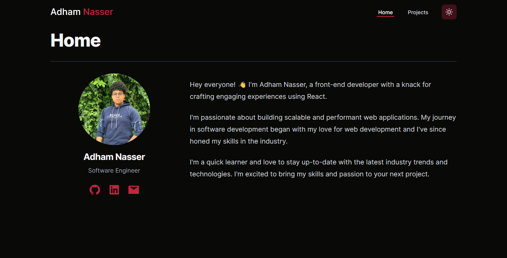

# AdhamZportfolio

## Overview

Welcome to my portfolio! This repository contains the source code for my personal portfolio website. It's designed to showcase my skills, projects, and provide information about me.

## Technologies Used

- **Next.js**: Used for building a React-based web application.
- **React**: JavaScript library for building user interfaces.
- **Sanity**: Content management system for managing project data.
- **Tailwind CSS**: Utility-first CSS framework for styling.

## Features

- **Responsive Design**: Ensures optimal viewing experience across various devices.
- **Dynamic Data Fetching**: Retrieves project data dynamically from Sanity CMS.
- **Social Media Integration**: Links to my social media profiles for networking.
- **Project Showcase**: Highlights my recent projects with project details.
- **Contact Information**: Provides ways to get in touch with me.

## Contributing

Contributions are welcome! If you'd like to contribute to this project, please follow these steps:

1. Fork the repository.
2. Create a new branch (git checkout -b feature/new-feature).
3. Make your changes and commit them (git commit -am 'Add new feature').
4. Push to the branch (git push origin feature/new-feature).
5. Create a new Pull Request.

## Live Demo

Check out the live demo of the project [here](https://adhamz.vercel.app/).

## Contact Me

If you have any questions or suggestions regarding the project, feel free to contact me:

- Email: [adhamxiii22](mailto:adhamxiii22@gmail.com)
- LinkedIn: [Adham](https://www.linkedin.com/in/adhamnasser/)
- GitHub: [Adhamxiii](https://github.com/Adhamxiii)
